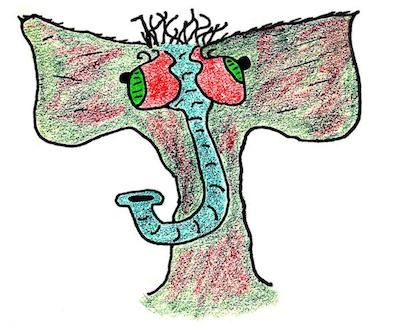

# The Keymaker

**You can definitely trust this keymaker. [credit](credits.md)**

The Keymaker is the object that is used to authenticate with the third party
service and generate the OAuth keys the application needs to do things on behalf
of a user.

In theory, not all Keymakers must do OAuth, but in practice,
_all_ Keymakers do OAuth.

## The Three-Legged OAuth Process

The Keymaker carries out a one-time authorization step that needs to 
be done once for each Sheep = bot = account.

The Keymaker will be given a set of "items" (more on this in a moment), with one
item = one Sheep = one bot = one account, etc.  The Keymaker iterates through
each item and performs the three-legged OAuth process.

Here's a summary of the process:

* The three legs are: the user (the bot account), the third party service (Github/Google/Twitter/other), and the consumer (your rainbowmindmachine app - specifically, the Keymaker)
* The Keymaker will initiate the process by requesting an OAuth URL from the third party
    (this is how an app asks a user for permission to access their account)
* Third party will return an OAuth URL to the Keymaker, which will pass it to the user
* The user will open the URL in their browser, and sign in using a bot account
* Third party will verify the credentials of the user, and create a temporary token
* This token is returned to the API application (via callback URL/other mechanism)
* API application sends the token to the third party, which verifies the token matches
* Third party gives the API application a new OAuth token. This is the magic token
    that allows the OAuth application to do things with the bot account.

Why the song and dance? The three-legged authentication process is intended to 
allow API applications to verify a user's identity (i.e., yes this user _actually_ granted
permission for the API application to control their account) without having to handle
sensitive data like a user's hashed password. It also keeps the third party in
control of the process.

## Keymaker Credentials

### Keymaker Input: API Keys

There are two pieces of information that are required
to do things as your API application (independent of any
bot accounts):

* API application key
* API application secret key

These are the two pieces of information that are required to prove
to the third party service that you are the actual owner of your
application.

Each service stores these pieces of information in different ways,
and calls them by different names. For example:

* Client key/client secret key
* Consumer token/consumer token secret
* API token/API secret token
* etc...

The [boring mind machine](#)
library provides a base OAuth Keymaker class
called BoringOAuthKeymaker. This class implements
the OAuth process in a generic way. The details
specific to the third party service are then implemented
in child classes (e.g., GithubKeymaker).

### Keymaker Output: OAuth Keys

In general, the Keymaker creates a set of bot account keys
corresponding to a set of items.

Once the Keymaker and the user go through the three-legged
authentication process for one bot account, the Keymaker
will create a JSON file with the bot key so that it can
be used again in the future.

The bot key contains both the API keys for the application,
and the OAuth keys for the bot account.

## Using the Keymaker

For details about how to create keys using the
OAuth Keymaker base class, see the 
[boring mind machine documentation](#).

To extend the Keymaker class, you should override
the `make_keys()` method to create keys in whatever
manner you wish.

