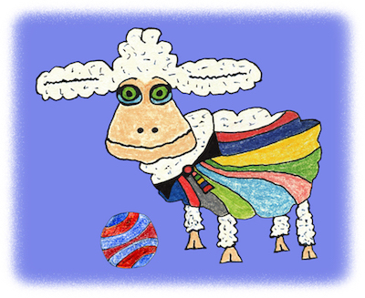

# The Sheep

**The rainbow mind machine sheep.**

The Sheep is the component of the bot flock that actually
performs the actions using the bot accounts.

The Shepherd will instruct each Sheep to start performing an action - either in
parallel (if it is a "forever" action like tweeting) or in serial (if it is a
"one-time" action, like changing the bot user's profile).

Each Sheep uses a bot key (created by the Keymaker and loaded by
the Shepherd) to create an API instance in the constructor.
Each Sheep then uses that API instance to perform actions.

The BoringSheep base class in [boring mind machine](https://pages.charlesreid1.com/boring-mind-machine)
defines a generic dispatcher method (which turns strings
into function calls) to allow Shepherds to call particular
actions for each Sheep.

## Defining Actions

To define an action, define a method for that action.
(For example, to define a tweet action, make a `tweet()` method
in the Sheep class you are using.)

To control how the action works and introduce variation, you can 
pass extra parameters (in the form of keyword arguments) to the
action method, and the Shepherd will pass those along to the Sheep.

The general pattern this follows is:

* set up or point to an API endpoint
* create or use the API client object to call the API endpoint
* process the results

